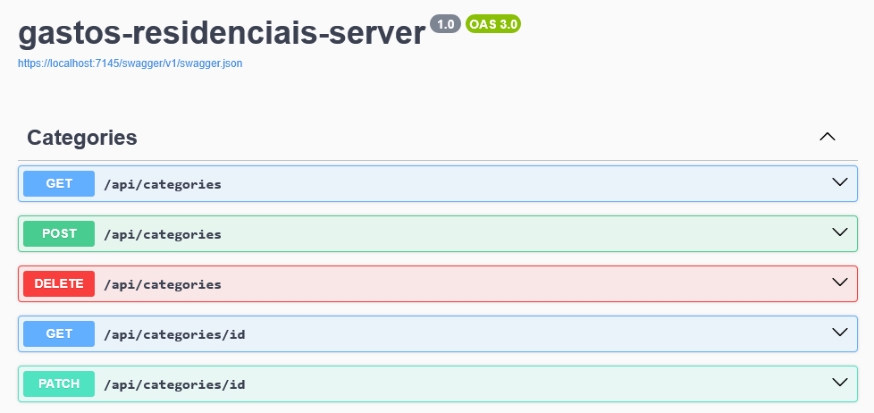
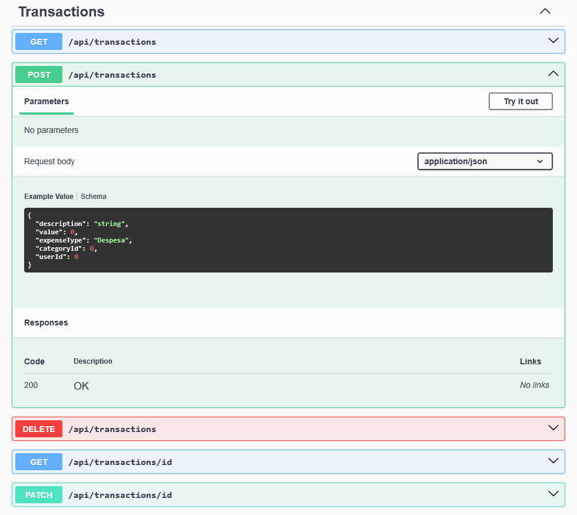

# Website para gastos residenciais

### Sumário
  * [Descrição](#descrição)
  * [Frontend](#frontend)
  * [Stack utilizada](#stack-utilizada)
  * [Instalação](#instalação)
  * [Documentação](#documentação)
  * [Screenshots](#screenshots)
    + [Tela do Swagger exibindo os endpoints de categoria](#tela-do-swagger-exibindo-os-endpoints-de-categoria)
    + [Tela do Swagger exibindo os endpoints de transação](#tela-do-swagger-exibindo-os-endpoints-de-transação)
  * [Licença](#licença)

# Descrição

Esse repositório armazena o código-fonte do backend (ou seja, o *server*) para um aplicativo web de gerenciamento de gastos residênciais. 

Atráves do aplicativo é possivel adicionar, visualizar e remover dados das entidades:

- Usuário, possui informações de nome, idade e transações vinculadas. 
- Categória, possui uma descrição e o tipo de despesa.
- Transação, armazena uma descrição, valor, finalidade (Receita ou Despesa), categória e usuário.

## Frontend

Além do backend, também foi desenvolvido um projeto de frontend em React + TypeScript. Que também tem um guia de detalhes técnicos e instalação: 

[Link para o Repositório do frontend.](https://github.com/Wr3tchedTorch/gastos-residenciais-client)

## Stack utilizada

**Back-end:** .NET, C#, EF Core, Mapster, MySql.

**Front-end:** React, TypeScript, Vite, Axios, Material UI.

## Instalação

1. Baixe o MySQL Workbench, crie uma conta de root e guarde a senha.

2. Clone o repositório ou faça download do código-fonte:

```bash
  git clone https://github.com/Wr3tchedTorch/gastos-residenciais-server
```

Quando você clonar o projeto, o caminho vai ser algo como:

`C:\caminho-onde-voce-clonou-o-projeto\gastos-residenciais-server\gastos-residenciais-server`

Existem duas pastas chamadas "gastos-residenciais-server" pois a primeira pasta com esse nome é a pasta da solução, onde todos os projetos são encontrados, já a segunda é o projeto principal, de onde o aplicativo é inicializado.

Para facilitar o entendimento, as pastas vão ser chamadas de:
- Pasta do projeto: a primeira pasta, que contém todos os projetos.
- Pasta principal: a pasta `\gastos-residenciais-server\gastos-residenciais-server`.

3. Abra o arquivo `appsettings.Development.json` localizado na pasta principal e modifique o campo "DatabaseConnectionString" com o seu nome de usuário e senha do MySQL Workbench:

```json
"DatabaseConnectionString": "Server=localhost;Database=gerenciamento_de_gastos;Uid=root;Pwd=root;"
```

4. Realize a migração do banco de dados:

Abra a pasta do projeto pelo PowerShell e digite:

```bash
eftools.ps1 database update
```

Ou pelo terminal:

```
dotnet ef database update --project ./Persistence --startup-project ./gastos-residenciais-server
```
5. Abra a pasta principal pelo terminal e execute o seguinte comando:

```bash
  dotnet run
```

Vários *logs* vão aparecer, e no final a URL do projeto vai ser exibida.

6. Agora é só interagir com a API através do Swagger:

https://localhost:7145/swagger/index.html

Ou pelo Frontend:

[Guia de instalação do frontend](https://github.com/Wr3tchedTorch/gastos-residenciais-client?tab=readme-ov-file#instala%C3%A7%C3%A3o)

## Documentação

Esse projeto foi desenvolvido utilizando .NET como framework e C# como linguagem de programação. Pois são ferramentas simples, robustas e eficiêntes. O principal foco do desenvolvimento foi em performance e organização do código, que segue uma estrutura baseada em camadas conhecida como arquitetura ONION.

Essa arquitetura separa as funcionalidades do sistema em camadas. As camadas superiores são dependentes das camadas inferiores, mas o contrários não pode ser verdade (para evitar dependência circular e manter as regras de negócio separadas e independentes).

As 3 camadas principais utilizadas nesse projeto foram: dominio, onde ficam as regras de negócio do projeto, essa camada não tem dependência com nenhuma outra; persistência, onde fica a lógica própria do software, como a implementação dos repositórios e as configurações e migrações do banco de dados, essa camada tem dependência na camada de dominio; apresentação, a camada superior que é responsável por definir *endpoints* que serão consumidos na API, essa camada tem dependência nas camadas de persistência e dominio.

Como dependências externas, o projeto conta com uma biblioteca de mapeamento (*Mapster*) para melhor legibilidade do código. E também um ORM de banco de dados (EF Core) para uma abstração entre código e banco.

## Screenshots

### Tela do Swagger exibindo os endpoints de categoria



### Tela do Swagger exibindo os endpoints de transação



## Licença

[GPL-3.0](https://choosealicense.com/licenses/gpl-3.0/)

